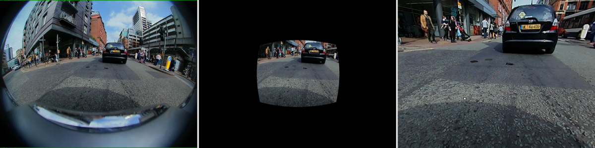
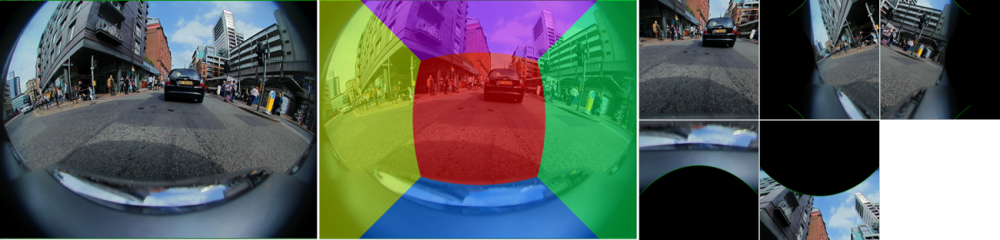
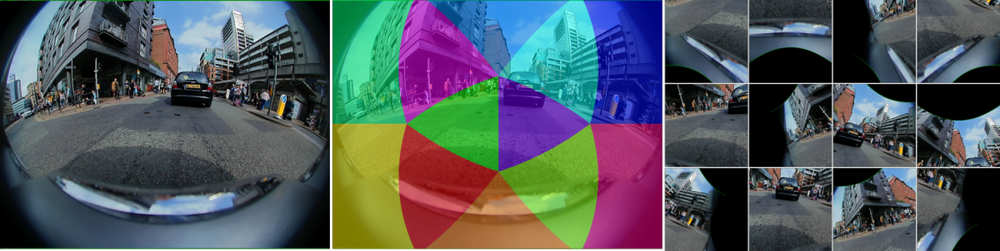

# fishi

A zero-shot benchmark for open-vocabulary semantic segmentation on the fisheye [WoodScape](https://woodscape.valeo.com/) dataset.

Open-vocabulary (OV) segmentation models take free-form text prompts instead of a fixed list of classes, but they are trained on ordinary perspective photos. Fisheye cameras break that assumption, capturing a very wide field of view at the cost of strong radial distortion that curves straight lines and stretches the periphery. fishi is about making OV models work better and more generally on fisheye while keeping the open-vocabulary capability that makes them worth using. Many routes could help, training among them, and all stay viable as long as they preserve that capability, which is what this benchmark measures. The first strategy benchmarked here is geometric preprocessing, a training-free option that leaves the model untouched. It reprojects the fisheye into views closer to what the models expect, runs the unchanged model, and maps the labels back to the fisheye so the comparison stays fair.

Geometric preprocessing does not help the stronger pipelines: feeding in the raw fisheye scores as high as any reprojected view. Rectify, which trades field of view for a conventional perspective, collapses. SAM 3 leads every setting, and its zero-shot mIoU edges past the supervised baseline of the WoodScape challenge. The detailed numbers are in [Results](#results).

## Contents

- [What the benchmark compares](#what-the-benchmark-compares)
- [Install](#install)
- [Dataset](#dataset)
- [Command line](#command-line)
- [Reproduce](#reproduce)
- [Add your own method](#add-your-own-method)
- [Results](#results)
- [Limitations](#limitations)
- [Next steps](#next-steps)
- [Project layout](#project-layout)
- [Development](#development)
- [References](#references)
- [License](#license)
- [Credits](#credits)

## What the benchmark compares

### The preprocessings

Every nontrivial preprocessing reprojects through WoodScape's fisheye camera model. Each of the four surround-view cameras (front, rear, mirror-left, mirror-right) has a per-image calibration with a principal-point offset and aspect ratio. The lens maps an incidence angle $\theta$ to image radius $\rho$ with a fourth-order radial polynomial:

$$
\rho(\theta) = k_1\theta + k_2\theta^2 + k_3\theta^3 + k_4\theta^4
$$

None ignores the calibration. Rectify, Patches, and Tangent Images use it to move pixels between the fisheye and their views, which is also why Rectify has to drop the wide periphery that a pinhole cannot represent.

Each preprocessing turns one fisheye frame into one or more views for the model, then maps the predicted labels back to the fisheye for scoring. WoodScape frames are about one megapixel. Rectify renders at the input size, and the gnomonic views are square at the input height. Each backbone then resizes internally to its own input size.

**None** feeds the raw fisheye straight to the model. It is the baseline every other variant must beat.

**Rectify** warps the fisheye into a single flat pinhole view, the conventional way to undistort. It looks natural to a model trained on ordinary photos, but a pinhole cannot hold a wide field of view, so most of the scene falls outside the frame.



*The fisheye input, the rectified pinhole view, and that view at full size. The wide periphery is gone.*

**Patches** projects the fisheye onto the faces of a cube, so the whole sphere is covered by a handful of low distortion images. Coverage is nearly complete, but each face is a separate image and introduces seams.



*The fisheye input, the cubemap faces drawn over it, and the rendered faces.*

**Tangent Images**, after [Eder et al. (2020)](https://arxiv.org/abs/1912.09390), reprojects the fisheye onto the gnomonic tangent planes of a subdivided icosahedron, tiling the sphere with many small, nearly distortion-free windows.



*The fisheye input, the tangent planes drawn over it, and the rendered views.*

**Merging views back.** Patches and Tangent Images produce several views per frame. To return to the fisheye, each fisheye pixel takes the label of the most face-on view that covers it (the smallest incidence angle), resampled by nearest neighbour. Pixels that no view covers stay void, which scores as a miss. Tangent tiles overlap by ten percent and keep a 100 degree window. Patches drops the rear face.

### The pipelines

All four take an image and a list of class names and return a label map, with no fisheye-specific training.

- **Grounding DINO + SAM 1** and **Grounding DINO + SAM 2** detect open-vocabulary boxes with [Grounding DINO](https://arxiv.org/abs/2303.05499), then turn each box into a mask with [SAM](https://arxiv.org/abs/2304.02643) or [SAM 2](https://arxiv.org/abs/2408.00714), the pairing introduced by [Grounded SAM](https://arxiv.org/abs/2401.14159).
- **OpenWorldSAM** pairs SAM 2 with a vision-language model to produce dense labels ([Xiao et al., 2025](https://arxiv.org/abs/2507.05427)).
- **SAM 3** segments directly from text prompts in one model ([Segment Anything with Concepts, 2025](https://arxiv.org/abs/2511.16719)).

### Models

The numbers depend on the exact checkpoints and thresholds, which are the class defaults run by the command line. OpenWorldSAM is the exception: its config and weights come from its own repository and are passed at run time.

| pipeline               | detector                                | segmenter or model                          | size                         | thresholds                 | inference dtype |
| ---------------------- | --------------------------------------- | ------------------------------------------- | ---------------------------- | -------------------------- | --------------- |
| SAM 3                  | native text prompt                      | `facebook/sam3`                           | only released variant        | score 0.5, mask 0.5        | bf16 autocast   |
| Grounding DINO + SAM 1 | `IDEA-Research/grounding-dino-base`   | `facebook/sam-vit-huge`                   | DINO base, SAM ViT-Huge      | box 0.25, text 0.25        | bf16 segmenter  |
| Grounding DINO + SAM 2 | `IDEA-Research/grounding-dino-base`   | `facebook/sam2-hiera-large`               | DINO base, SAM 2 Hiera-Large | box 0.25, text 0.25        | bf16 segmenter  |
| OpenWorldSAM           | SAM 2 with a BEiT vision-language model | external`--config-file` and `--weights` | per upstream repo            | dense argmax, no threshold | bf16 autocast   |

One pipeline goes by a few names: the Python class, the short name in result files and tables, the CLI subcommand, and the install extra. They line up as follows.

| pipeline               | class            | result name      | CLI subcommand       | extra            |
| ---------------------- | ---------------- | ---------------- | -------------------- | ---------------- |
| SAM 3                  | `SamThree`     | `sam3`         | `run sam3`         | `sam3`         |
| Grounding DINO + SAM 1 | `GroundedSam1` | `gdino+sam1`   | `run gdino-sam1`   | `gdino-sam1`   |
| Grounding DINO + SAM 2 | `GroundedSam2` | `gdino+sam2`   | `run gdino-sam2`   | `gdino-sam2`   |
| OpenWorldSAM           | `OpenWorldSam` | `openworldsam` | `run openworldsam` | `openworldsam` |

The result name uses `+`, while the CLI subcommand and the extra use `-`, so `fishi run gdino-sam1` writes cells named `gdino+sam1__*`.

### Classes and prompts

WoodScape labels ten classes. Void (id 0) is ignored in scoring and never prompted, leaving nine scored classes. The prompt for each is its name with underscores turned into spaces, a plain noun phrase with no prompt engineering, which keeps the open-vocabulary setting honest. For the box-based pipelines, the detector's text is matched back to a class by exact match and then by substring, which is unambiguous for this taxonomy.

| id | class        | prompt       | group   |
| -- | ------------ | ------------ | ------- |
| 0  | void         | not prompted | ignored |
| 1  | road         | road         | stuff   |
| 2  | lanemarks    | lanemarks    | stuff   |
| 3  | curb         | curb         | stuff   |
| 4  | person       | person       | thing   |
| 5  | rider        | rider        | thing   |
| 6  | vehicles     | vehicles     | thing   |
| 7  | bicycle      | bicycle      | thing   |
| 8  | motorcycle   | motorcycle   | thing   |
| 9  | traffic_sign | traffic sign | thing   |

## Install

The library and command line require only lightweight dependencies (numpy, opencv, pillow, pydantic, pydantic-settings, structlog, typer, rich):

```bash
uv sync
```

The heavy model and download dependencies are optional extras, so you install only what you run:

```bash
uv sync --extra download        # fetch the dataset (gdown)
uv sync --extra sam3            # SAM 3
uv sync --extra gdino-sam1      # Grounding DINO + SAM 1
uv sync --extra gdino-sam2      # Grounding DINO + SAM 2
uv sync --extra openworldsam    # OpenWorldSAM base
```

The three HuggingFace pipelines share one stack, so any of them resolves the same versions. OpenWorldSAM is detectron2-based and is installed from its own repository, whose path is passed at run time with `--repo-path`.

SAM 3 is a gated model on the Hugging Face Hub. Request access on its model page, then sign in with `huggingface-cli login` or set an `HF_TOKEN` before running it.

## Dataset

```bash
uv run fishi download --data-directory data
```

This fetches WoodScape (RGB images, segmentation labels, and per-image calibration) into `data/` and needs the download extra. On disk each sample is a stem such as `00015_FV` with three files: `rgb_images/<stem>.png`, `semantic_annotations/gtLabels/<stem>.png`, and `calibration/<stem>.json`. Samples missing any of the three are skipped.

The benchmark uses a fixed 70/15/15 partition (seed 0), committed as `splits.json` so every run sees the same data: 5764 train, 1235 validation, and 1235 test, over 8234 complete samples. All numbers in this README are on the test split. Train and validation are untouched here and reserved for the training follow-up in [Next steps](#next-steps). WoodScape itself is released under its own non-commercial, research-only license, separate from the code license below.

## Command line

```bash
uv run fishi run sam3 --data-directory data --metrics-directory metrics --cache-directory cache
uv run fishi report --metrics-directory metrics
uv run fishi diagnose --cache-directory cache --data-directory data
uv run fishi ceiling --data-directory data
uv run fishi demos --data-directory data --output-directory demos
```

Every command has `--help`. `run` loads one model at a time and sweeps it over all preprocessings, saving one report per cell. Finished cells are skipped and predictions are cached, so interrupted runs resume cheaply. `report` aggregates the per-cell reports into the mIoU and mean accuracy tables. `diagnose` reads the cached predictions back and recomputes the deeper metrics described in [Results](#results). `ceiling` and `demos` need no model.

## Reproduce

Run each model over the sweep, one at a time (so the heavy pipelines never coexist in memory), then aggregate:

```bash
uv run fishi run sam3        --metrics-directory metrics --cache-directory cache
uv run fishi run gdino-sam1  --metrics-directory metrics --cache-directory cache
uv run fishi run gdino-sam2  --metrics-directory metrics --cache-directory cache
uv run fishi report          --metrics-directory metrics
uv run fishi diagnose        --cache-directory cache
```

The runs expect a CUDA GPU. Pipelines load one at a time, so a single GPU that holds one model is enough, and, because runs are resumable, a full sweep can be done in chunks.

The lockfile (`uv.lock`) pins torch 2.12.1, torchvision 0.27.1, transformers 5.12.1, and accelerate 1.14.0 on Python 3.12. transformers 5.x is required for the SAM 2 and SAM 3 classes. OpenWorldSAM's detectron2 stack is external and is not captured by the lockfile.

No global seed is set. Inference is single-pass and greedy (fixed thresholds, no sampling), so it is deterministic up to the bfloat16 autocast and CUDA kernel nondeterminism that can move the last digit on a rerun. The data split is seeded and committed, so the partition itself is exact.

The resampling ceiling is deterministic and needs no model:

```bash
uv run fishi ceiling
```

## Add your own method

Two extension points let you compare a new method on the same split and metric.

A new model implements the SegmentationPipeline contract (a name and a predict):

```python
from fishi import Identity, load_split, run

class MyModel:
    name = "mymodel"
    def predict(self, image, prompts):
        ...  # return a fisheye label map

run(Identity(), MyModel(), load_split("test"), metrics_directory="metrics")
```

A new preprocessing subclasses Processor (preprocess and postprocess):

```python
from fishi import Processor, SamThree, load_split, run

class MyWarp(Processor):
    name = "mywarp"
    def preprocess(self, image, calibration, interpolation=1):
        ...
    def postprocess(self, predictions, calibration):
        ...

run(MyWarp(), SamThree(), load_split("test"), metrics_directory="metrics")
```

If you produced predictions elsewhere, score them directly against the split:

```python
from fishi import load_split, score

score(my_predictions, load_split("test"))  # my_predictions maps each stem to a fisheye label map
```

## Results

All numbers are over the 1235-sample test split, with the void class ignored. Two kinds of numbers appear. The model scores depend on weights, library versions, and hardware, so a reproduction may differ slightly. The resampling ceiling is deterministic and reproduces exactly, because it round-trips the ground-truth labels through each preprocessing with no model involved.

### Task and baseline

fishi adopts the task and primary metric of the [CVPR 2021 OmniCV WoodScape segmentation challenge](https://arxiv.org/abs/2107.08246): mean IoU over the nine non-void classes, with mean accuracy reported alongside. The challenge's supervised baseline, a PSPNet with a ResNet-50 backbone, scores mIoU 0.50 and mean accuracy 0.67. The top team reached mIoU 0.86. Our best zero-shot pipeline, SAM 3 on the raw fisheye, reaches mIoU 0.553, edging past that supervised baseline on the primary metric while trailing it on mean accuracy (0.601 versus 0.67).

The baseline is supervised and trained on fisheye, while these pipelines are zero-shot, and the challenge scores a hidden test set rather than our public-release split, so the comparison is a scale reference rather than a head-to-head.

### What the metrics mean

The first two are the challenge metrics. The rest we add to look closer.

- **mIoU** is the mean intersection-over-union across the classes, the headline score. Every class counts equally, so rare classes weigh as much as common ones. For a class $c$, $\mathrm{IoU}_c = \frac{\mathrm{TP}_c}{\mathrm{TP}_c + \mathrm{FP}_c + \mathrm{FN}_c}$, and mIoU averages it over the nine non-void classes.
- **mean accuracy** is the mean per-class recall, $\frac{\mathrm{TP}_c}{\mathrm{TP}_c + \mathrm{FN}_c}$ averaged over the same nine classes.
- **FWIoU** is the per-class IoU weighted by each class's share of ground-truth pixels $t_c$, so frequent classes dominate: $\mathrm{FWIoU} = \sum_c \frac{t_c}{\sum_k t_k}\,\mathrm{IoU}_c$.
- **things** and **stuff** are the mean IoU over the object classes and the region classes respectively, the two groups in [Classes and prompts](#classes-and-prompts).
- The error split looks at the pixels that belong to a real class and asks where the wrong ones went. **confused** is the fraction handed to a different real class, a recognition error. **missed** is the fraction handed to the background, a recall failure where the model produced no mask. The remainder are correct, so correct plus confused plus missed is one.

### Model scores

Mean IoU, pipeline by preprocessing:

| pipeline               | none  | rectify | patches | tangent |
| ---------------------- | ----- | ------- | ------- | ------- |
| SAM 3                  | 0.553 | 0.098   | 0.533   | 0.552   |
| Grounding DINO + SAM 1 | 0.423 | 0.100   | 0.417   | 0.419   |
| Grounding DINO + SAM 2 | 0.434 | 0.096   | 0.427   | 0.428   |
| OpenWorldSAM           | 0.215 | 0.075   | 0.254   | 0.257   |

Mean accuracy, the second challenge metric:

| pipeline               | none  | rectify | patches | tangent |
| ---------------------- | ----- | ------- | ------- | ------- |
| SAM 3                  | 0.601 | 0.102   | 0.611   | 0.608   |
| Grounding DINO + SAM 1 | 0.514 | 0.109   | 0.525   | 0.541   |
| Grounding DINO + SAM 2 | 0.523 | 0.103   | 0.534   | 0.546   |
| OpenWorldSAM           | 0.295 | 0.092   | 0.421   | 0.420   |

Reading across a row, Rectify collapses while Patches and Tangent Images sit on the none baseline for the three stronger pipelines, and SAM 3 leads every cell. OpenWorldSAM is the exception, the one pipeline that improves under Patches and Tangent, though it stays well below the others.

### Per class

Per-class IoU for the leading cell, SAM 3 on none:

| road | vehicles | bicycle | motorcycle | person | traffic sign | curb | rider | lanemarks |
| ---- | -------- | ------- | ---------- | ------ | ------------ | ---- | ----- | --------- |
| 0.87 | 0.89     | 0.71    | 0.70       | 0.60   | 0.59         | 0.57 | 0.05  | 0.00      |

SAM 3 segments the common classes well but fails rider (0.05) and lanemarks (0.00) almost entirely. These two near-zero classes are what hold the equally weighted mIoU below the frequency-weighted IoU.

### Resampling ceiling

The most a perfect model could reach under each preprocessing, mean IoU:

| none  | rectify | patches | tangent |
| ----- | ------- | ------- | ------- |
| 1.000 | 0.183   | 0.999   | 0.999   |

This round-trips the ground-truth labels (nearest neighbour) through each preprocessing, so it measures only the label-resampling loss, not seams or lost context. Patches and Tangent Images lose almost nothing this way, so the small drop they cause to a real model comes from the model, not from discarded geometry. Rectify caps at 0.18 even with a perfect model, because it drops most of the field of view.

### Diagnostics

The full grid, computed from our cached predictions with `fishi diagnose`:

| cell                  | mIoU  | FWIoU | things | stuff | confused | missed |
| --------------------- | ----- | ----- | ------ | ----- | -------- | ------ |
| sam3, none            | 0.553 | 0.821 | 0.589  | 0.481 | 0.046    | 0.095  |
| sam3, patches         | 0.533 | 0.803 | 0.565  | 0.470 | 0.041    | 0.124  |
| sam3, rectify         | 0.098 | 0.350 | 0.046  | 0.201 | 0.014    | 0.632  |
| sam3, tangent         | 0.552 | 0.803 | 0.591  | 0.474 | 0.040    | 0.125  |
| gdino+sam1, none      | 0.423 | 0.702 | 0.473  | 0.325 | 0.114    | 0.123  |
| gdino+sam1, patches   | 0.417 | 0.695 | 0.444  | 0.361 | 0.107    | 0.139  |
| gdino+sam1, rectify   | 0.100 | 0.368 | 0.043  | 0.214 | 0.021    | 0.607  |
| gdino+sam1, tangent   | 0.419 | 0.686 | 0.446  | 0.365 | 0.120    | 0.131  |
| gdino+sam2, none      | 0.434 | 0.700 | 0.487  | 0.328 | 0.108    | 0.128  |
| gdino+sam2, patches   | 0.427 | 0.668 | 0.471  | 0.340 | 0.115    | 0.150  |
| gdino+sam2, rectify   | 0.096 | 0.367 | 0.045  | 0.198 | 0.027    | 0.599  |
| gdino+sam2, tangent   | 0.428 | 0.679 | 0.468  | 0.348 | 0.129    | 0.118  |
| openworldsam, none    | 0.215 | 0.636 | 0.184  | 0.277 | 0.285    | 0.000  |
| openworldsam, patches | 0.254 | 0.653 | 0.231  | 0.301 | 0.281    | 0.000  |
| openworldsam, rectify | 0.075 | 0.328 | 0.028  | 0.170 | 0.091    | 0.571  |
| openworldsam, tangent | 0.257 | 0.677 | 0.227  | 0.318 | 0.252    | 0.000  |

Frequency-weighted IoU sits far above mIoU everywhere, so frequent classes score higher than rare ones, which drag the equally weighted mean down. The instance-oriented pipelines (Grounding DINO + SAM, and SAM 3) score higher on things than on stuff. OpenWorldSAM is dense and forced-choice, assigning every pixel one of the nine classes with no background option, so its missed is zero by construction and its error split is not on the same footing as the box-based pipelines, which leave uncovered pixels as background. SAM 3's residual error is mostly missed rather than confused, meaning it leaves some objects unsegmented rather than assigning the wrong class.

## Limitations

The scope is deliberately narrow. Only one family of adaptation is tested here, geometric preprocessing, with the models left untouched. The study uses a single dataset (WoodScape) and one fixed set of plain text prompts, so it does not probe prompt sensitivity. Scores are a single run per cell, with no rerun over seeds or weights. OpenWorldSAM is dense and forced-choice while the other pipelines can abstain to background, so its error decomposition is not directly comparable.

## Next steps

This study keeps every model untouched, so all numbers above come from the held-out test split alone. The committed 70/15/15 partition exists for what comes next. A planned follow-up applies training to the open-vocabulary models on fisheye data, then measures whether the open-vocabulary capability survives. Losing that capability is exactly the risk the training-free preprocessing route avoids by leaving the model untouched, and the train and validation splits are there so the work can fit and tune without ever touching the test set.

## Project layout

```
src/fishi/
  preprocess/    Identity, Rectify, Patches, Tangent Images, shared gnomonic base, visualization
  segmentation/  base contract, grounded_sam/, openworldsam, sam3, semantic
  metrics/       core (mIoU, accuracy), diagnostics (FWIoU, error split, groups)
  woodscape/     dataset, calibration, classes, splits, config, download
  evaluation.py  per-image evaluate, run, and score
  sweep.py       run one pipeline across every preprocessing
  report.py      aggregate per-cell reports into the matrix
  analysis.py    resampling ceiling and error decomposition
  cli.py         the command line
```

## Development

```bash
uv run ruff check .
uv run ruff format --check .
uv run mypy
uv run pytest
```

## References

**Dataset and challenge**

- WoodScape: A Multi-Task, Multi-Camera Fisheye Dataset for Autonomous Driving. Yogamani et al., ICCV 2019. [arXiv:1905.01489](https://arxiv.org/abs/1905.01489) · [code](https://github.com/valeoai/WoodScape)
- WoodScape Fisheye Semantic Segmentation for Autonomous Driving, CVPR 2021 OmniCV Workshop Challenge. Ramachandran et al., 2021. [arXiv:2107.08246](https://arxiv.org/abs/2107.08246)

**Segmentation models and pipelines**

- Segment Anything (SAM). Kirillov et al., ICCV 2023. [arXiv:2304.02643](https://arxiv.org/abs/2304.02643) · [code](https://github.com/facebookresearch/segment-anything)
- SAM 2: Segment Anything in Images and Videos. Ravi et al., 2024. [arXiv:2408.00714](https://arxiv.org/abs/2408.00714) · [code](https://github.com/facebookresearch/sam2)
- SAM 3: Segment Anything with Concepts. Meta AI, 2025. [arXiv:2511.16719](https://arxiv.org/abs/2511.16719) · [code](https://github.com/facebookresearch/sam3)
- Grounding DINO: Marrying DINO with Grounded Pre-Training for Open-Set Object Detection. Liu et al., ECCV 2024. [arXiv:2303.05499](https://arxiv.org/abs/2303.05499) · [code](https://github.com/IDEA-Research/GroundingDINO)
- Grounded SAM: Assembling Open-World Models for Diverse Visual Tasks. Ren et al., 2024. [arXiv:2401.14159](https://arxiv.org/abs/2401.14159) · code: [Grounded-Segment-Anything](https://github.com/IDEA-Research/Grounded-Segment-Anything), [Grounded-SAM-2](https://github.com/IDEA-Research/Grounded-SAM-2)
- OpenWorldSAM: Extending SAM2 for Universal Image Segmentation with Language Prompts. Xiao et al., NeurIPS 2025. [arXiv:2507.05427](https://arxiv.org/abs/2507.05427) · [code](https://github.com/GinnyXiao/OpenWorldSAM)

**Preprocessing**

- Tangent Images for Mitigating Spherical Distortion. Eder et al., CVPR 2020. [arXiv:1912.09390](https://arxiv.org/abs/1912.09390) · [code](https://github.com/meder411/Tangent-Images)

## License

The code is released under the MIT License. See [LICENSE](LICENSE). WoodScape is covered by its own non-commercial, research-only license, which governs the dataset.

## Credits

fishi is our final project for INF0416 (Redes Neurais Profundas, Deep Neural Networks) at the Universidade Federal de Goiás (UFG), 2026.1 (TA). The course leaves the topic open, and we chose open-vocabulary segmentation on the distorted space of fisheye imagery.

- **André Vinícius Moura Koraleski** proposed and implemented Tangent Images, and integrated the team's independently developed code into this repository.
- **Caio Lucca dos Santos Oliveira** proposed the project's premise of open-vocabulary models on geometrically distorted imagery, proposed and implemented Patches, and implemented and ran the Grounding DINO + SAM 2 pipeline.
- **Henrick de Souza Silva** proposed and implemented Rectify, and implemented and ran the Grounding DINO + SAM 1 pipeline.
- **Lucas Nogueira Barroso** implemented and ran the SAM 3 pipeline.
- **Rian de Souza Santos** implemented and ran the OpenWorldSAM pipeline, also bringing it into the benchmark.
